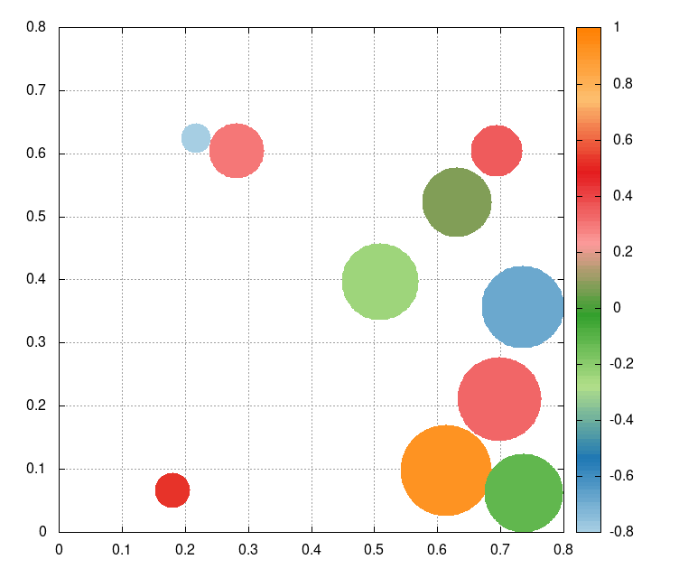

#   PyColloid
##  A simple colloid simulation

A simple simulation of a group of particles in a box, with electromagnetic interactions. As an output you will get two files, a *png* with the first and last state, and a *gif* with the temporal evolution.



## Prerequisites

*   **[Python3](https://www.python.org/)** (but you can use the virtualenv provided too).
*   **[Gnuplot](http://gnuplot.sourceforge.net/)**

You will need a *bash* or other UNIX-based terminal for running the following commands. However, you can run the simulation by hand by running [``main.py``](src/main.py), and then, by running [``PlotCopy.gp``](src/PlotCopy.gp).

##  Usage

Download the latest release from [releases](https://github.com/JARA99/PyColloid/releases).

<!-- Then go to the project folder and follow the execution instructions.

```
cd PyColloid
``` -->

Then extract the source code. Open a terminal on the PyColloid folder and then just execute the shell script [``RUN.sh``](RUN.sh) by typing:

```
./RUN.sh
```

Optionally you can use the virtualenv provided by doing ``source venv-simulation/bin/activate`` and then executing the shell script.


Ideally you will get a terminal output like this:

```
Case: [Low/High]APF
100 frames in animation sequence
```

But most likely you will have some: ``Collision loop exceeded for this particle``. Which means that you will have overlaps between particles in the animation. You can try minimizing this by putting a higher value on *CollisionLoops* (see the next list), but you will increase the computation time. Other method is to play with the *DeltaTime*, *MaxVo* and *ForceConstant* parameters, this will not add computation time, but change the whole simulation environment.

You can change the parameters of the simulation by changing the [Parameters.txt](Parameters.txt) file. This file its by itself very self-explanatory but here is a bit of documentation:

*   **Case:** Select the method of sorting the initial state by choosing the scenario *HighAPF* (high atomic packing factor), or *LowAPF* (low atomic packing factor).
*   **APF:** Set a fixed APF, this will rewrite the number of particles, you can turn it off by tying -1.
*   **Particles:** Number of particles on the simulation.
*   **Mass:** Mass of each particle.
*   **MaxCharge:** Maximum charge of each particle.
*   **MinCharge:** Minimum charge of each particle.
*   **MaxRadius:** Maximum radius of each particle.
*   **MinRadius:** Minimum radius of each particle.
*   **MaxX:** *x* length of the box.
*   **MinY:** *y* length of the box.
*   **MaxVo:** Maximum initial velocity in any direction for the particles.
*   **ForceConstant:** Parameter k used on Coulumb's law.
*   **DeltaTime:** Time of each evolving interval.
*   **Iterations:** Total of DeltaTime iterated.
*   **CollisionLoops:** Maximum iterations for calculating a collision.
*   **Palette:** Palette used for coloring the charge, you can use any of the ones listed [here](Palettes.png).
*   **Invert:** Invert the palette on plot.

Finally, you can change some parameters and re-plot without having to re-simulate by simply typing:

```
./RePlot.sh
```

Remember you can choose the palette of your choice from this list:


<!-- Maintain the dimensions of the box in a way that the atomic packing factor doesn't go over *0.7*.[^1]

[^1]: Consult [this article](https://en.wikipedia.org/wiki/Atomic_packing_factor) for more information on *APF*. -->


##  To Do

- [ ] Improve collision dynamics.
- [x] Program [InitialValues.py](src/InitialValues.py)
- [x] Program [TemporalEvolution.py](src/TemporalEvolution.py)
- [x] Program [CollisionDetector.py](src/CollisionDetector.py)
- [x] Program [CollisionDynamics.py](src/CollisionDynamics.py)
- [x] Program [main.py](src/main.py)
- [x] Program the plotter base
- [x] Finish the plotter  

<!-- Fork the repository for collaboration, then send your pull requests. -->